# MVP: Pipeline de Dados na Nuvem com o Dataset da Olist

Pipeline de dados construído no Databricks Free Edition, da coleta à análise, sobre o *Brazilian E-Commerce Public Dataset by Olist*. O projeto segue a arquitetura medalhão (bronze, prata e ouro) e responde a onze perguntas sobre os hábitos de consumo e de venda no marketplace entre 2017 e 2018.

## Estrutura do repositório

Todo o código está na pasta `MVP Pós`. Os notebooks do pipeline ficam em `transformations` e são executados em sequência por um job do Databricks. Os demais estão numerados na ordem de leitura. Os notebooks de análise apenas leem as tabelas e não gravam dados.

| Notebook | Função |
|---|---|
| [`00_Pre_Projeto`](MVP%20P%C3%B3s/00_Pre_Projeto.ipynb) | Planejamento: objetivo, perguntas, dados, arquitetura e raciocínio da modelagem |
| [`transformations/Bronze_Ingestao`](MVP%20P%C3%B3s/transformations/Bronze_Ingestao.ipynb) | Pipeline, etapa 1: coleta dos dados no Kaggle e carga na camada bronze |
| [`transformations/Silver_Limpeza`](MVP%20P%C3%B3s/transformations/Silver_Limpeza.ipynb) | Pipeline, etapa 2: tipagem, padronização e correções |
| [`transformations/Gold_Modelagem`](MVP%20P%C3%B3s/transformations/Gold_Modelagem.ipynb) | Pipeline, etapa 3: tabelas modeladas para as perguntas |
| [`01_Analises: Bronze -> Prata`](MVP%20P%C3%B3s/01_Analises%3A%20Bronze%20-%3E%20Prata.ipynb) | Diagnóstico de qualidade dos dados brutos, que justifica cada regra da prata |
| [`02_Analises: Prata -> Ouro`](MVP%20P%C3%B3s/02_Analises%3A%20Prata%20-%3E%20Ouro.ipynb) | Verificações para a construção do ouro e validação das tabelas criadas |
| [`03_Catalogo_de_dados`](MVP%20P%C3%B3s/03_Catalogo_de_dados.py) | Descrições do catálogo, dos esquemas, do volume e de todas as tabelas e colunas no Unity Catalog |
| [`04_Analise_Final`](MVP%20P%C3%B3s/04_Analise_Final.ipynb) | Respostas às perguntas do objetivo, com discussão |

---

## Contexto de Negócios e Perguntas

### Problema

O objetivo é entender os hábitos de consumo e de venda no marketplace Olist entre 2017 e 2018: onde estão compradores e vendedores, quanto se gasta e se vende em cada estado, que categorias concentram a demanda, como os clientes pagam e como avaliam suas compras ao longo do tempo.

O marketplace é observado pelas duas pontas da transação. Do lado do **comprador**, interessa o pedido: quanto foi pago, de que forma, com que satisfação. Do lado do **vendedor**, interessa o item vendido: o que foi vendido, por quanto e de onde saiu. Essa distinção orienta toda a modelagem.

### Perguntas

1. Qual estado tem o maior número de compras online?
2. Qual estado tem o maior gasto com compras online?
3. Qual estado mais vende em número de vendas?
4. Qual estado mais vende em valor?
5. Quais são as notas dadas pelos clientes, no geral e por estado?
6. Qual o método de pagamento mais utilizado?
7. Qual categoria apresenta mais demanda?
8. Houve mudança na média das avaliações ao longo dos trimestres?
9. Qual o crescimento entre o primeiro semestre de 2017 e o primeiro semestre de 2018?
10. Qual a proporção de compras pagas à vista e de forma parcelada?
11. Qual o valor médio das compras à vista e das parceladas?

### Dados

**Fonte:** [Brazilian E-Commerce Public Dataset by Olist](https://www.kaggle.com/datasets/olistbr/brazilian-ecommerce), publicado no Kaggle. Contém cerca de 100 mil pedidos reais realizados na plataforma entre 2016 e 2018, anonimizados. A Olist, com sede em Curitiba, conectava pequenos e médios lojistas aos grandes marketplaces. Os vendedores do dataset são, portanto, clientes da Olist.

**Licença**: Permite uso não comercial. O uso acadêmico deste projeto é compatível.

**Estrutura:** nove tabelas relacionais, normalizadas, pensadas para registrar a operação do marketplace.

| Tabela | Conteúdo | Chave |
|---|---|---|
| `olist_orders_dataset` | Pedidos, status e datas de cada etapa | `order_id` |
| `olist_customers_dataset` | Cliente de cada pedido, com cidade, UF e CEP | `customer_id` |
| `olist_order_items_dataset` | Itens de cada pedido, com preço e frete | `order_id` + `order_item_id` |
| `olist_order_payments_dataset` | Pagamentos de cada pedido, com meio, parcelas e valor | `order_id` + `payment_sequential` |
| `olist_order_reviews_dataset` | Avaliações dos pedidos, com nota e comentário | `review_id` + `order_id` |
| `olist_products_dataset` | Produtos, com categoria, medidas e peso | `product_id` |
| `olist_sellers_dataset` | Vendedores, com cidade, UF e CEP | `seller_id` |
| `olist_geolocation_dataset` | Coordenadas por prefixo de CEP | sem chave |
| `product_category_name_translation` | Tradução das categorias para o inglês | `product_category_name` |

---

## Carga dos Dados

A coleta é feita no notebook `transformations/Bronze_Ingestao`, com a biblioteca Python `kagglehub`, que baixa o dataset público.

1. O `kagglehub` baixa os nove arquivos CSV para o disco local da máquina que executa o notebook.
2. Os arquivos são copiados para o volume `pospucrio.bronze.raw` do Unity Catalog. A cópia é necessária porque o Spark, que processa os dados de forma distribuída, não enxerga o disco local. O volume é armazenamento em nuvem acessível ao Spark e preserva os arquivos originais para reprocessamento.
3. Cada arquivo é lido pelo Spark e gravado como tabela Delta no esquema `pospucrio.bronze`, com o nome do arquivo original.

O bronze é uma cópia fiel da fonte, com todas as colunas gravadas como texto e sem inferência de tipos. Inferir tipos na leitura já seria uma interpretação (o CEP, por exemplo, perderia o zero à esquerda). As únicas opções de leitura aplicadas são as necessárias para ler o CSV corretamente, como `multiLine`, que preserva comentários de avaliações com quebra de linha.

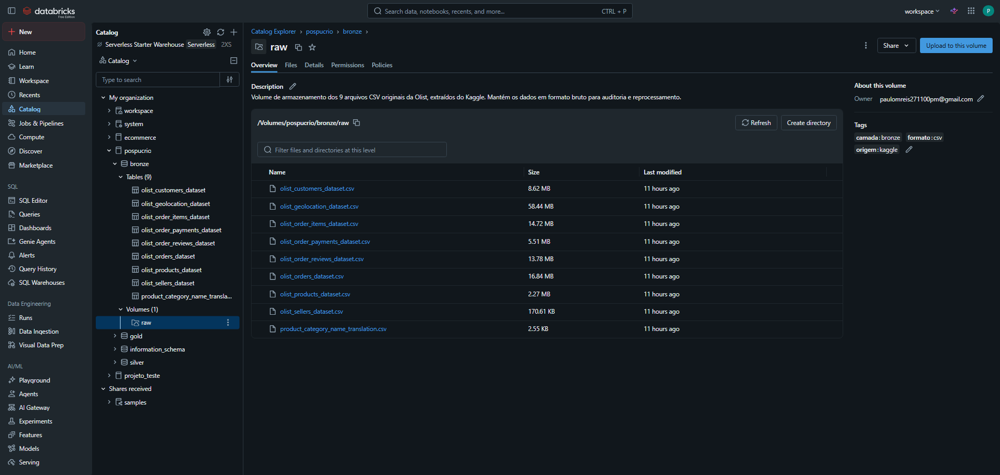
---

## Modelagem e Catálogo de Dados 

### Arquitetura

| Camada | Esquema | Conteúdo |
|---|---|---|
| Bronze | `pospucrio.bronze` | Tabelas como vieram da fonte, todas as colunas como texto |
| Prata | `pospucrio.silver` | As mesmas tabelas, com tipagem, padronização e correções |
| Ouro | `pospucrio.gold` | Tabelas modeladas para responder às perguntas |

### Método

A camada ouro foi desenhada a partir das perguntas, e não da estrutura da origem. Para cada pergunta foram definidos a métrica (o que se conta ou soma), o agrupamento, o filtro e a **granularidade**, isto é, o nível em que a conta precisa ser feita. Agrupando as perguntas pela granularidade, as tabelas aparecem.

| # | Pergunta | Métrica | Agrupa por | Filtro | Granularidade |
|---|---|---|---|---|---|
| 1 | Estado com mais compras | Contagem de pedidos | Estado do cliente | Entregues | Pedido |
| 2 | Estado com maior gasto | Soma do valor pago | Estado do cliente | Entregues | Pedido |
| 3 | Estado que mais vende (número) | Contagem de itens | Estado do vendedor | Entregues | Item |
| 4 | Estado que mais vende (valor) | Soma do preço | Estado do vendedor | Entregues | Item |
| 5 | Notas | Distribuição, média e % de notas 1 e 2 | Estado do cliente | Todos | Pedido |
| 6 | Método mais usado | Contagem de pedidos | Método principal | Entregues | Pedido |
| 7 | Categoria de maior demanda | Contagem de itens | Categoria | Entregues | Item |
| 8 | Evolução das notas | Média e % de notas 1 e 2 | Trimestre | Todos | Pedido |
| 9 | Crescimento entre semestres | Pedidos e valor pago | Semestre | Entregues | Pedido |
| 10 | Proporção à vista e parcelado | Contagem de pedidos | Forma de pagamento | Entregues | Pedido |
| 11 | Valor médio à vista e parcelado | Média e mediana do valor pago | Forma de pagamento | Entregues | Pedido |

O princípio que organiza o modelo: **compra é pedido, venda é item**. O consumidor compra um pedido, que pode conter produtos de vários vendedores, em estados diferentes. O vendedor vende itens. Por isso, o estado do vendedor e a categoria do produto só existem no nível do item. Juntar as duas perspectivas em uma tabela duplicaria valores.

### Modelo escolhido: flat

O modelo é composto por duas tabelas, uma por granularidade, com os atributos necessários já incorporados como colunas. O esquema estrela foi considerado e descartado. Ele compensa quando as dimensões são ricas e compartilhadas, ou quando as perguntas não são conhecidas de antemão. Aqui, as perguntas usam essencialmente o estado do cliente e do vendedor e a categoria do produto, e dimensões com um único atributo útil acrescentariam joins sem ganho. O volume é pequeno e o ouro é regenerado a partir da prata a cada execução, o que torna a redundância das tabelas largas irrelevante.

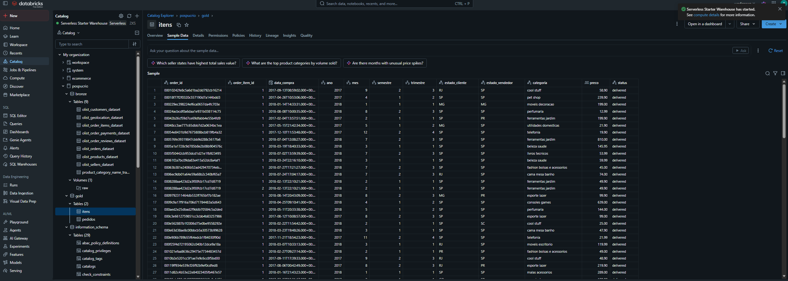

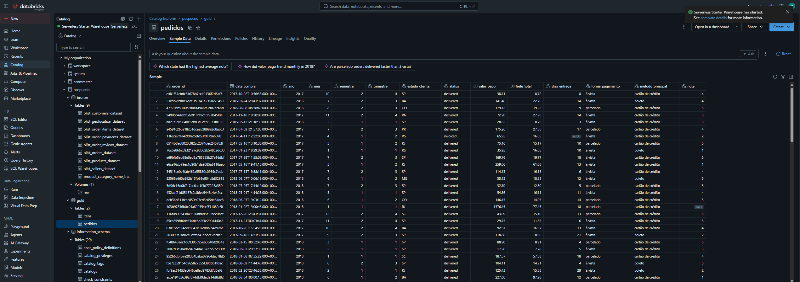
### Regras de negócio

- **Compra efetivada:** apenas pedidos com status `delivered`. Pedidos em status intermediário aparecem em volume estável desde o início de 2017, indicando pedidos que pararam e nunca foram concluídos.
- **Status mantido na tabela:** o filtro de entregues é aplicado nas consultas. As perguntas de avaliação usam todos os pedidos, para não excluir as avaliações de quem não recebeu o produto.
- **Valor do comprador:** soma de todos os pagamentos do pedido, com produtos, frete, juros e vouchers. A conferência com os itens mostrou que o voucher cobre parte do valor da compra, como um meio de pagamento.
- **Valor do vendedor:** preço do item, sem frete.
- **Forma de pagamento:** parcelado quando algum pagamento, exceto voucher, tem mais de uma parcela. Usa-se o maior número de parcelas, e não a soma.
- **Método principal:** com voucher e outro meio, vale o outro meio. Em pedido pago só com voucher, vale o voucher. Entre dois meios que não são voucher, vale o de maior valor.
- **Nota:** com mais de uma avaliação, vale a de resposta mais recente.
- **Categoria:** nomes originais em português. Produtos sem categoria recebem o rótulo "sem categoria".
- **Período:** pedidos a partir de janeiro de 2017. A série trimestral vai de 2017-T1 a 2018-T2, e as comparações entre anos usam os mesmos meses.

**Revisão do modelo.** As colunas `frete_total` e `dias_entrega` não estavam no planejamento. Foram acrescentadas durante a análise, quando a hipótese de que a distância entre comprador e vendedor influencia as compras exigiu medir frete e prazo de entrega. Em vez de consultar a prata diretamente, o modelo foi estendido, mantendo a camada ouro como única fonte da análise.

### Catálogo de dados

As descrições abaixo estão registradas no Unity Catalog pelo notebook `03_Catalogo_de_dados`, que documenta o catálogo `pospucrio`, os esquemas, o volume e todas as tabelas das três camadas, coluna por coluna. Abaixo estão transcritas as tabelas da camada ouro.

#### `pospucrio.gold.pedidos`

Uma linha por pedido, a partir de 2017. Perspectiva do comprador. Origem: `silver.orders`, `customers`, `order_items`, `order_payments` e `order_reviews`.

| Coluna | Tipo | Descrição e domínio | Linhagem |
|---|---|---|---|
| `order_id` | string | Identificador do pedido, chave da tabela. Hash hexadecimal de 32 caracteres | `silver.orders` |
| `data_compra` | timestamp | Data e hora da compra, a partir de 2017-01-01 | `silver.orders.order_purchase_timestamp` |
| `ano` | int | 2017 ou 2018 | Derivado de `data_compra` |
| `mes` | int | 1 a 12 | Derivado de `data_compra` |
| `semestre` | int | 1 (janeiro a junho) ou 2 | Derivado de `data_compra` |
| `trimestre` | int | 1 a 4 | Derivado de `data_compra` |
| `estado_cliente` | string | UF do cliente, uma das 27 siglas | `silver.customers`, via `customer_id` |
| `status` | string | delivered, shipped, canceled, unavailable, invoiced, processing, created ou approved | `silver.orders` |
| `valor_pago` | decimal(20,2) | Soma dos pagamentos, em reais, com frete, juros e vouchers. Maior ou igual a zero | Soma de `silver.order_payments.payment_value` |
| `frete_total` | decimal(20,2) | Soma do frete dos itens, em reais. Maior ou igual a zero. Nulo para pedidos sem itens | Soma de `silver.order_items.freight_value` |
| `dias_entrega` | int | Dias entre a compra e a entrega. Nulo se não entregue | Derivado de `silver.orders` |
| `forma_pagamento` | string | "à vista" ou "parcelado". Nulo para pagamento não definido ou parcelas inválidas | Regra sobre `silver.order_payments` |
| `metodo_principal` | string | "cartão de crédito", "cartão de débito", "boleto" ou "voucher". Nulo para pagamento não definido | Regra sobre `silver.order_payments` |
| `nota` | int | 1 a 5. Nulo se o pedido não foi avaliado | Regra sobre `silver.order_reviews` |

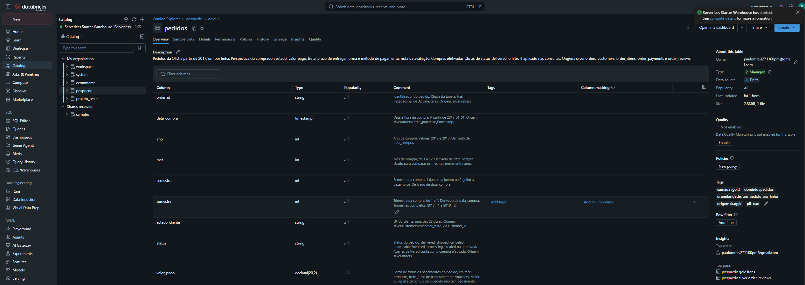

#### `pospucrio.gold.itens`

Uma linha por item vendido, a partir de 2017. Perspectiva do vendedor. Origem: `silver.order_items`, `orders`, `customers`, `sellers` e `products`.

| Coluna | Tipo | Descrição e domínio | Linhagem |
|---|---|---|---|
| `order_id` | string | Identificador do pedido. Com `order_item_id`, forma a chave | `silver.order_items` |
| `order_item_id` | int | Número do item no pedido, a partir de 1 | `silver.order_items` |
| `data_compra` | timestamp | Data e hora da compra do pedido, a partir de 2017-01-01 | `silver.orders` |
| `ano`, `mes`, `semestre`, `trimestre` | int | Mesmos domínios de `gold.pedidos` | Derivados de `data_compra` |
| `estado_cliente` | string | UF de quem comprou, uma das 27 siglas | `silver.customers`, via pedido |
| `estado_vendedor` | string | UF de quem vendeu. 23 UFs presentes | `silver.sellers.seller_state` |
| `categoria` | string | Categoria em português, com espaços. "sem categoria" para cadastros incompletos | `silver.products.product_category_name` |
| `preco` | decimal(10,2) | Preço do item em reais, sem frete. Maior que zero, com mediana de 74,99 e máximo de 6.735,00 | `silver.order_items.price` |
| `status` | string | Status do pedido. Apenas delivered conta como venda efetivada | `silver.orders.order_status` |

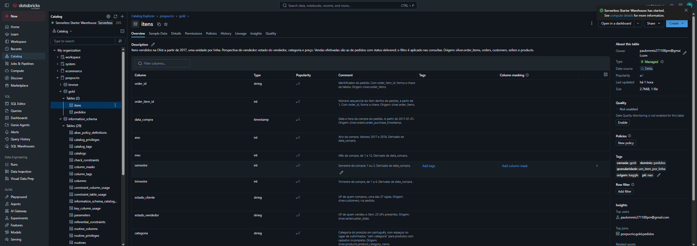

---

## Pipeline de Dados

O pipeline é dividido em três notebooks, um por camada, cada um lendo da camada anterior e gravando na seguinte. A separação permite executar apenas as etapas afetadas por uma mudança: alterar uma regra do ouro não exige baixar os dados novamente.

| Etapa | Notebook | Lê de | Grava em |
|---|---|---|---|
| Ingestão | `transformations/Bronze_Ingestao` | Kaggle | `pospucrio.bronze` |
| Limpeza | `transformations/Silver_Limpeza` | `pospucrio.bronze` | `pospucrio.silver` |
| Modelagem | `transformations/Gold_Modelagem` | `pospucrio.silver` | `pospucrio.gold` |
| Catálogo | `03_Catalogo_de_dados` | Tabelas das três camadas | Descrições no Unity Catalog |

As etapas são executadas em sequência por um job do Databricks, com cada tarefa dependendo da anterior. O catálogo roda por último porque `CREATE OR REPLACE` recria as tabelas e apaga as descrições anteriores. O gatilho é manual, já que o dataset é estático.

Princípios aplicados em todos os notebooks:
- **Reexecução segura:** todas as tabelas são criadas com `CREATE OR REPLACE`. Rodar o pipeline várias vezes produz sempre o mesmo resultado.
- **Falha explícita:** as conversões de tipo usam `CAST`, e não `try_cast`. Se uma carga futura trouxer um valor inválido, o pipeline falha e avisa, em vez de gravar nulo silenciosamente.
- **Documentação junto ao código:** cada transformação é precedida de uma explicação do que faz, por quê e com base em qual diagnóstico.

Principais transformações:
- **Prata:** tipagem de todas as colunas, padronização de cidades por uma função registrada no catálogo (`pospucrio.silver.padronizar_cidade`) e por uma lista de correções pontuais, CEP com cinco dígitos, correção de nomes de colunas grafados errado na origem e conversão em nulo de valores impossíveis, como zero parcelas e peso zero.
- **Ouro:** pagamentos, avaliações e fretes são reduzidos a uma linha por pedido **antes** dos joins, para não multiplicar valores. Em seguida, são aplicadas as regras de negócio.

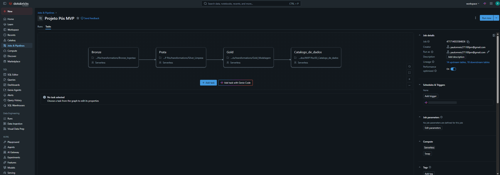
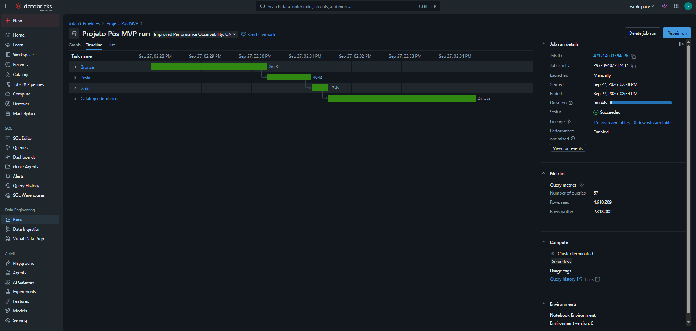
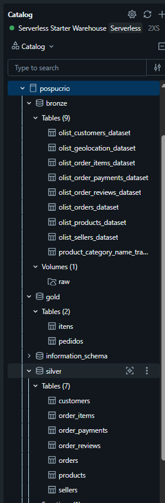
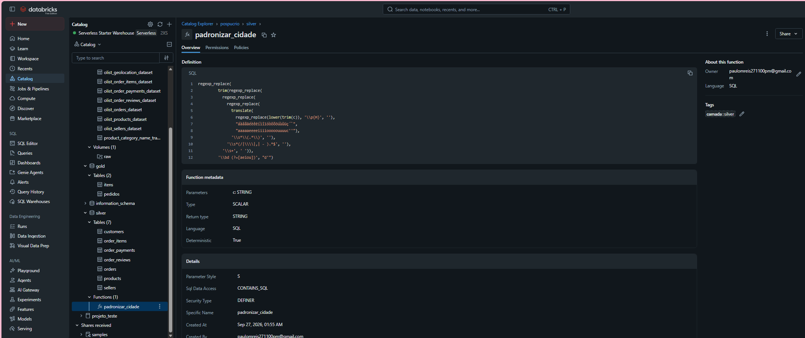
---

## Qualidade de Dados

O diagnóstico completo está no notebook `01_Analises: Bronze -> Prata`. Para cada tabela foram verificadas completude, consistência, unicidade, acurácia, outliers e integridade entre tabelas. Valores distantes do normal não foram tratados automaticamente como erro. Antes, mediu-se o comportamento normal por percentual e verificou-se se o extremo tinha explicação.

| Tabela | Problema encontrado | Tamanho | Tratamento |
|---|---|---|---|
| customers | Cidades com duas grafias, por apóstrofo trocado por espaço ou por hífen | 6 cidades | Regra na função de padronização e correção pontual |
| sellers | Estado digitado junto com a cidade, parênteses, acento no lugar de apóstrofo, til gravado separado | 23 cidades | Regras incorporadas à função de padronização |
| sellers | Grafias sem padrão ("portoferreira", "sbc") | 4 cidades | Correções pontuais |
| sellers | Número, e-mail ou só a UF no campo de cidade | 3 vendedores | Cidade anulada |
| orders | Status contraditório com as datas | 8 entregues sem data de entrega e 6 cancelados com data | Mantidos e documentados |
| orders | Postagem antes da aprovação e entrega antes da postagem | 1.359 e 23 pedidos | Mantidos e documentados |
| orders | Pedidos parados em status intermediário | Volume estável desde 2017 | Apenas `delivered` conta como compra |
| orders | Poucos pedidos em 2016, com lacuna, e em setembro e outubro de 2018 | 329 e 20 pedidos | Período a partir de 2017, série até 2018-T2 |
| order_items | Prazo de postagem em 2020, cerca de 1.050 dias após a compra | 4 itens | Mantidos, coluna não usada no modelo |
| order_items | Outliers de preço (até R$ 6.735) e frete (até R$ 409,68) | Cauda acima do percentil 99 | Verificados como coerentes com categoria, peso e volume e mantidos |
| order_payments | Pagamentos com zero parcelas em pedidos entregues | 2 | Convertidos em nulo |
| order_payments | Tipo `not_defined` com valor zero em pedidos cancelados e vouchers de valor zero | 3 e 6 | Mantidos, sem efeito nas regras |
| order_payments | Valor pago diferente de preço mais frete | 264 a mais e 39 a menos | Explicados por juros (249) e arredondamento (14) e mantidos |
| order_reviews | Mesma avaliação em vários pedidos do mesmo cliente | 789 avaliações | Mantidas, por representarem uma compra dividida em vários pedidos |
| order_reviews | Pedidos com mais de uma avaliação | 547 pedidos | Regra da resposta mais recente no ouro |
| products | Nomes de coluna grafados errado (`lenght`) | 2 colunas | Renomeados na prata |
| products | Cadastro incompleto, sem categoria, nome, descrição e fotos | 610 produtos (1,42% dos itens vendidos) | Rótulo "sem categoria" no ouro |
| products | Peso zero | 4 produtos | Convertido em nulo |
| products | Categorias com sufixo `_2` | 2 pares | Perfis de preço e peso distintos, mantidas separadas |
| geolocation | Tabela sem chave, não usada pelas perguntas | 1 tabela | Mantida apenas no bronze |

A validação da camada ouro está no notebook `02_Analises: Prata -> Ouro`. Todas as verificações passaram:
- Uma linha por pedido (99.112) e por item (112.280), sem perdas em relação à prata.
- Valor pago (R$ 15.949.509,78) e soma dos preços (R$ 13.541.857,78) idênticos entre prata e ouro.
- Forma de pagamento nula em apenas 5 pedidos, todos explicados, e parcelado apenas no cartão de crédito.
- Método principal coerente com a combinação de meios em todos os pedidos.
- Nota escolhida sem divergências em relação a um cálculo independente.

---

## Análise de Dados

A análise completa, com todas as consultas e discussões, está no notebook `04_Analise_Final`. Abaixo, a síntese de cada resposta, com os principais números e o resultado da consulta no Databricks. Compras e vendas consideram apenas pedidos entregues. Avaliações consideram todos os pedidos avaliados.

### 1. Qual estado tem o maior número de compras online?

| Estado | Compras | % |
|---|---|---|
| SP | 40.406 | 42,00 |
| RJ | 12.310 | 12,79 |
| MG | 11.319 | 11,76 |
| RS | 5.328 | 5,54 |
| PR | 4.903 | 5,10 |

São Paulo concentra 42% das compras, mais que o triplo do Rio de Janeiro. A população explica apenas parte do resultado. São Paulo compra quase o dobro de sua participação populacional, e a Bahia, metade. O frete e o prazo ajudam a explicar: compradores paulistas pagam frete médio de R$ 17,33 e recebem em 7 dias, enquanto no Norte e no Nordeste o frete chega a R$ 49 e o prazo, a 26 dias.

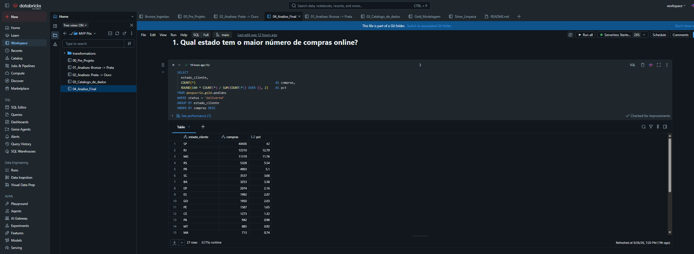
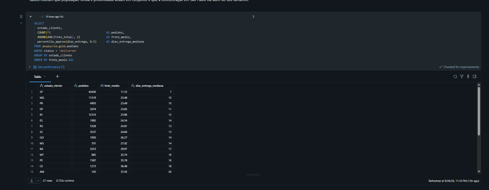
### 2. Qual estado tem o maior gasto com compras online?

| Estado | Gasto total (R$) | % | Ticket médio (R$) | Ticket mediano (R$) |
|---|---|---|---|---|
| SP | 5.756.706,26 | 37,44 | 142,47 | 93,64 |
| RJ | 2.046.698,14 | 13,31 | 166,26 | 112,22 |
| MG | 1.814.317,79 | 11,80 | 160,29 | 108,11 |
| RS | 858.904,29 | 5,59 | 161,21 | 108,00 |
| PR | 779.319,58 | 5,07 | 158,95 | 105,18 |

São Paulo lidera, mas com o menor ticket do país. Mesmo sem o frete, o valor das compras cresce com a distância de São Paulo, de R$ 125 para até R$ 218. Onde o frete é caro, só compensa comprar online produtos de valor mais alto.

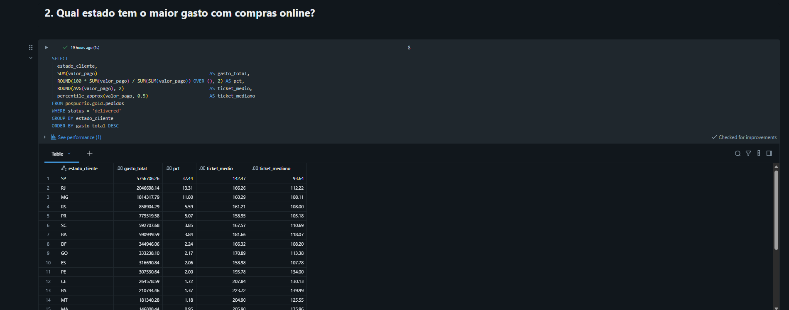
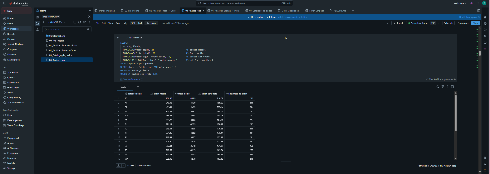
### 3. Qual estado mais vende em número de vendas?

| Estado do vendedor | Itens vendidos | % |
|---|---|---|
| SP | 78.419 | 71,37 |
| MG | 8.579 | 7,81 |
| PR | 8.445 | 7,69 |
| RJ | 4.646 | 4,23 |
| SC | 3.987 | 3,63 |
| RS | 2.162 | 1,97 |

Sul e Sudeste somam 97% dos itens vendidos. Como os vendedores são clientes da Olist, a distribuição mostra onde a empresa construiu sua base de lojistas. O Paraná, sede da empresa, aparece bem acima de seu peso populacional. Minas Gerais já era o segundo polo vendedor no início da série e se estabilizou, enquanto o Rio de Janeiro, com base menor, foi o que mais cresceu.

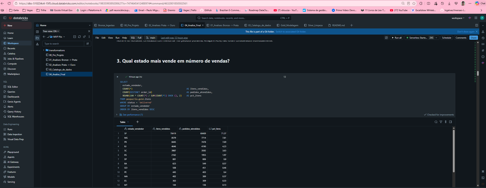
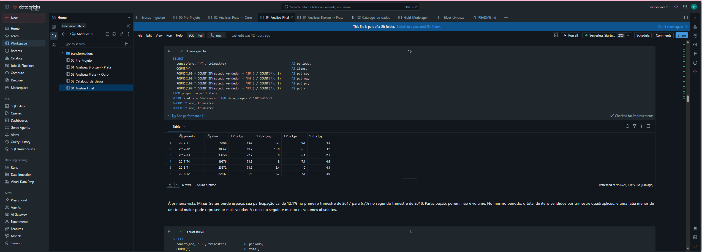
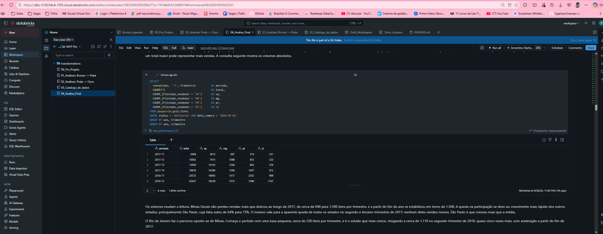

### 4. Qual estado mais vende em valor?

| Estado do vendedor | Valor vendido (R$) | % | Preço médio (R$) |
|---|---|---|---|
| SP | 8.487.299,48 | 64,39 | 108,23 |
| PR | 1.226.347,62 | 9,30 | 145,22 |
| MG | 975.967,19 | 7,40 | 113,76 |
| RJ | 813.290,60 | 6,17 | 175,05 |
| SC | 612.709,38 | 4,65 | 153,68 |
| BA | 277.763,96 | 2,11 | 445,85 |

O Paraná passa Minas Gerais por vender itens mais caros. A Bahia tem o maior preço médio entre os estados de volume relevante porque 91% de suas vendas se concentram em computadores, telefonia e informática.

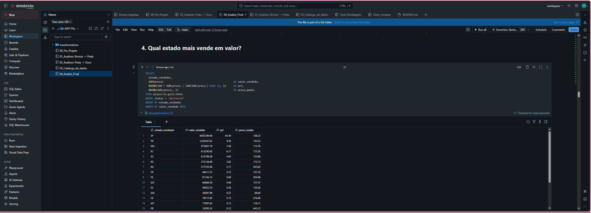
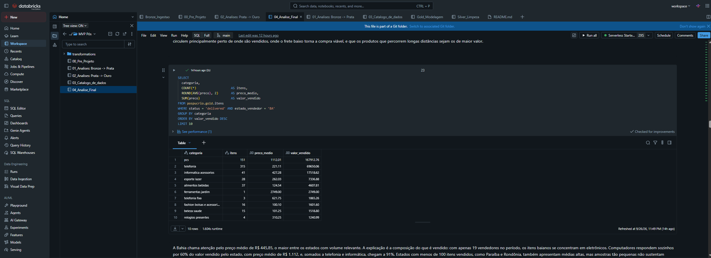

### 5. Quais são as notas dadas pelos clientes?

| Prazo de entrega | Avaliações | Nota média | % notas 1 e 2 |
|---|---|---|---|
| Até 7 dias | 30.516 | 4,41 | 7,6 |
| 8 a 14 dias | 37.695 | 4,30 | 9,1 |
| 15 a 21 dias | 15.995 | 4,12 | 12,2 |
| 22 a 30 dias | 7.219 | 3,54 | 25,8 |
| Mais de 30 dias | 4.135 | 2,19 | 64,9 |

A média geral é 4,09, com distribuição polarizada: 57,8% de notas 5 e 11,5% de notas 1. A polarização se explica pelo prazo de entrega, e a nota despenca depois de três semanas. As menores notas estão no Rio de Janeiro (3,88) e no Nordeste. No Rio, parte da diferença vem de mais pedidos não entregues e mais entregas longas. O restante fica como hipótese.

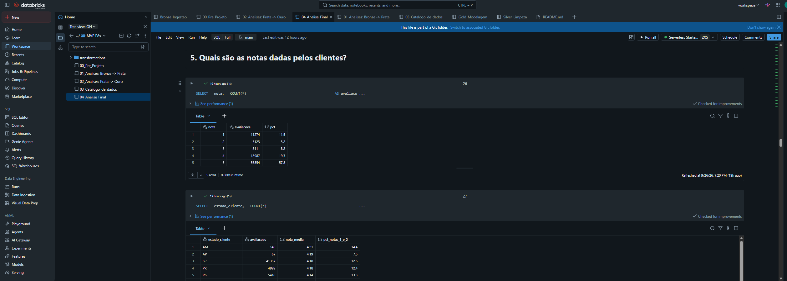
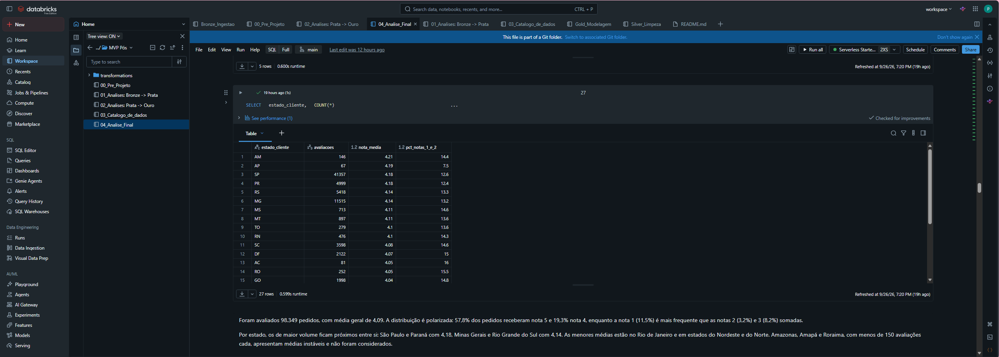
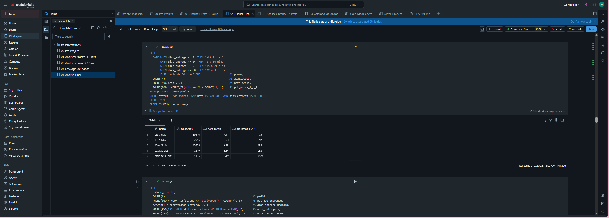
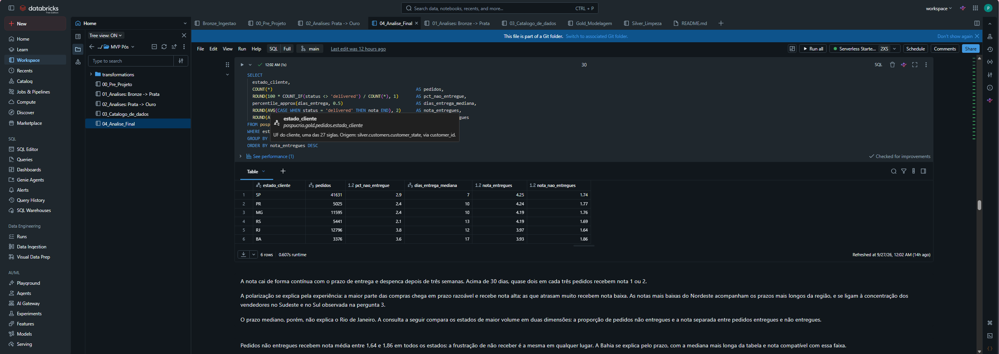
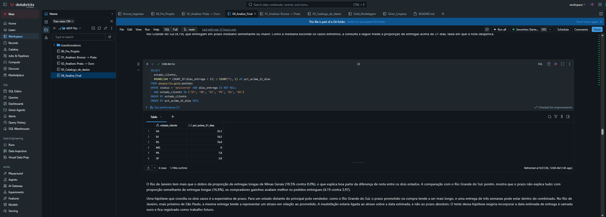

### 6. Qual o método de pagamento mais utilizado?

| Método principal | Pedidos | % |
|---|---|---|
| Cartão de crédito | 74.095 | 77,01 |
| Boleto | 19.140 | 19,89 |
| Voucher | 1.494 | 1,55 |
| Cartão de débito | 1.482 | 1,54 |

O parcelamento explica parte da preferência pelo cartão de crédito, mas mesmo entre as compras à vista o cartão supera o boleto. Os dados são anteriores ao Pix.

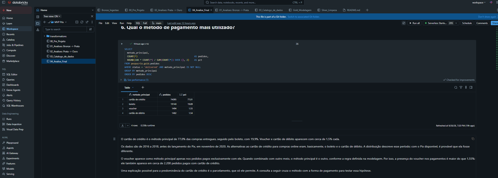
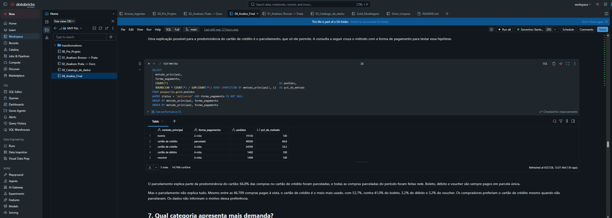

### 7. Qual categoria apresenta mais demanda?

| Categoria | Itens vendidos | % | Valor vendido (R$) | Preço médio (R$) |
|---|---|---|---|---|
| cama mesa banho | 10.945 | 9,96 | 1.022.955,77 | 93,46 |
| beleza saude | 9.422 | 8,57 | 1.229.557,50 | 130,50 |
| esporte lazer | 8.414 | 7,66 | 952.840,40 | 113,24 |
| moveis decoracao | 8.095 | 7,37 | 706.237,17 | 87,24 |
| informatica acessorios | 7.632 | 6,95 | 888.055,59 | 116,36 |

A demanda é dispersa. Nenhuma categoria alcança 10% dos itens, e as cinco primeiras somam 40,5%. Beleza e saúde lidera em valor, e relógios e presentes tem o maior preço médio entre as categorias de maior volume.

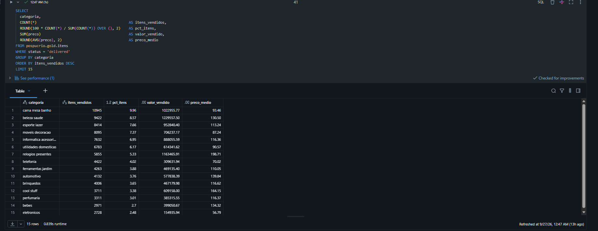

### 8. Houve mudança na média das avaliações ao longo dos trimestres?

| Período | Nota média | % notas 1 e 2 | % entregas acima de 21 dias |
|---|---|---|---|
| 2017-T1 | 4,05 | 15,1 | 9,9 |
| 2017-T2 | 4,12 | 13,5 | 9,5 |
| 2017-T3 | 4,20 | 12,0 | 7,4 |
| 2017-T4 | 4,00 | 16,6 | 16,6 |
| 2018-T1 | 3,87 | 19,7 | 21,9 |
| 2018-T2 | 4,21 | 11,9 | 8,0 |

A nota caiu no fim de 2017 e no início de 2018, período de pico de volume, com a Black Friday, e voltou quando os prazos se normalizaram. A proporção de entregas longas acompanha a de notas baixas nos mesmos trimestres.
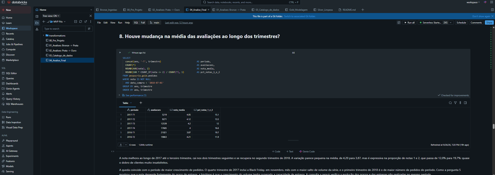
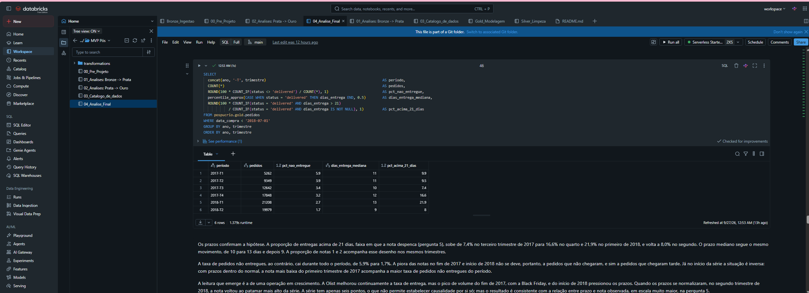
### 9. Qual o crescimento entre o primeiro semestre de 2017 e o de 2018?

| Indicador | 1º sem. 2017 | 1º sem. 2018 | Crescimento |
|---|---|---|---|
| Pedidos entregues | 13.933 | 40.273 | 189,0% |
| Valor pago (R$) | 2.261.458,22 | 6.439.657,06 | 184,8% |
| Ticket médio (R$) | 162,31 | 159,90 | -1,5% |

O crescimento veio do aumento no número de compras, e não de compras maiores. Ele ajuda a explicar a pressão sobre a logística observada na pergunta 8.

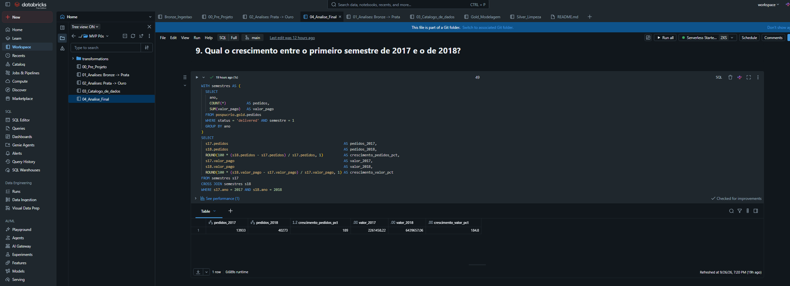

### 10. Qual a proporção de compras à vista e parceladas?

| Forma de pagamento | Pedidos | % |
|---|---|---|
| Parcelado | 49.500 | 51,45 |
| À vista | 46.709 | 48,55 |

A proporção subestima a preferência pelo parcelamento, porque apenas o cartão de crédito permite parcelar. Entre as compras no cartão, 66,8% foram parceladas.

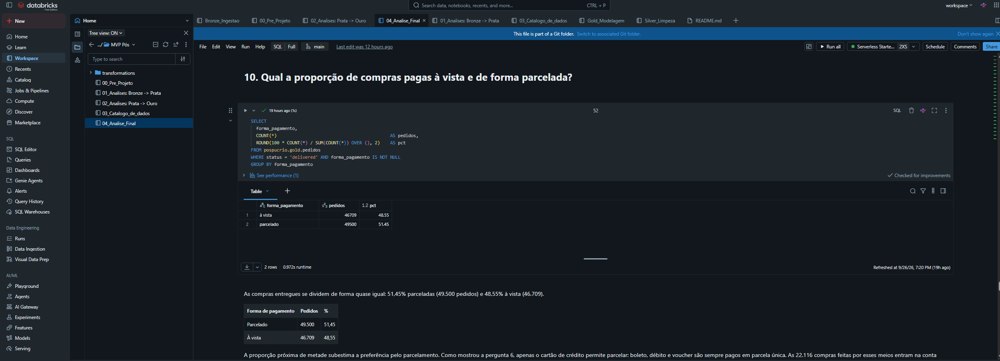

### 11. Qual o valor médio das compras à vista e das parceladas?

| Forma de pagamento | Valor médio (R$) | Valor mediano (R$) |
|---|---|---|
| À vista | 120,21 | 79,24 |
| Parcelado | 197,19 | 134,49 |

| Faixa de valor (cartão de crédito) | % parcelado |
|---|---|
| Até R$ 50 | 38,7 |
| R$ 50 a 100 | 56,0 |
| R$ 100 a 150 | 73,5 |
| R$ 150 a 200 | 81,9 |
| R$ 200 a 300 | 85,1 |
| R$ 300 a 500 | 88,0 |
| Acima de R$ 500 | 91,9 |

A proporção de parcelamento cresce com o valor, sem um ponto de corte nítido. Que quase quatro em cada dez compras de até R$ 50 sejam parceladas indica que parcelar era um hábito.

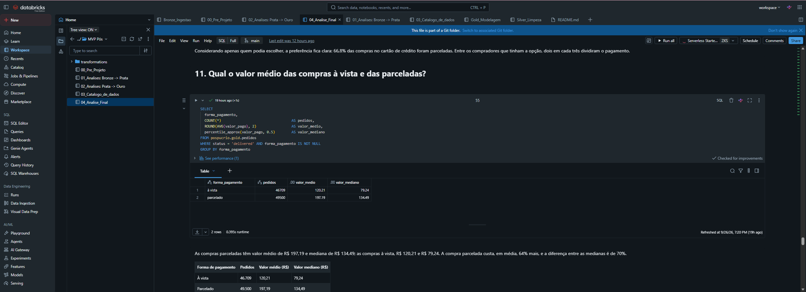

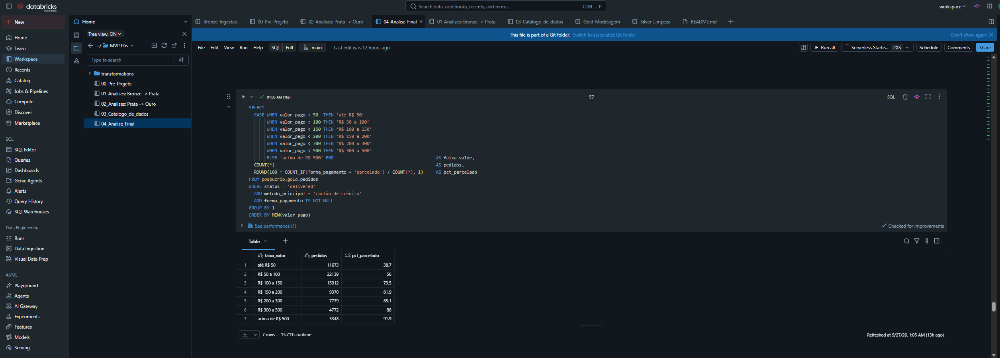
### Discussão geral

As respostas descrevem um marketplace organizado em torno de um centro geográfico. Com os vendedores concentrados no Sudeste e no Sul, o comprador distante paga frete maior e espera mais. Esse custo molda o que se compra: longe dos vendedores, compra-se menos e mais caro. Molda também a satisfação, que é sobretudo uma avaliação da entrega, tanto entre estados quanto ao longo do tempo. Quando o crescimento acelerado pressionou os prazos, as notas caíram, e se recuperaram quando os prazos se normalizaram. No pagamento, o cartão de crédito domina, e o parcelamento aparece como hábito, presente até nas compras pequenas. A demanda é dispersa entre as categorias.

Os resultados descrevem os clientes e vendedores de um único marketplace e não se generalizam para o comércio eletrônico brasileiro. Três questões ficaram em aberto. A primeira é por que Minas Gerais começou o período com uma base de lojistas maior que a do Rio de Janeiro. A segunda é o que causou o pico de vendas do Paraná no início de 2018. A terceira é se a insatisfação dos compradores cariocas se deve ao atraso em relação ao prazo prometido.

---

## Autoavaliação

**Objetivo.** O objetivo era entender os hábitos de consumo e de venda na Olist entre 2017 e 2018, por meio de onze perguntas. Todas foram respondidas, e as respostas se conectam numa explicação coerente. A concentração dos vendedores no Sudeste e no Sul define o frete e o prazo de quem compra longe, o que por sua vez molda o que se compra e como se avalia a compra. Três questões levantadas durante a análise ficaram em aberto, por dependerem de dados que o modelo não inclui: a diferença entre as bases de lojistas de Minas Gerais e do Rio de Janeiro, o pico de vendas do Paraná no início de 2018 e a relação entre a insatisfação dos compradores cariocas e o prazo prometido.

**A formulação do problema.** A maior dificuldade do projeto veio antes de tudo, formular um problema. O trabalho pede que se crie um problema e depois se construa a solução para ele, sem que exista necessáriamente uma demanda real por trás. Para mim, é difícil partir de um problema inventado. Escolhi dados de comércio eletrônico por serem próximos da minha área de atuação, e as perguntas foram construídas a partir do que o dataset permitia responder. O resultado é um objetivo mais descritivo do que eu gostaria, sobre um período já distante. Os dados vão até 2018, antes do Pix e de mudanças relevantes no comércio eletrônico. Considero essa a parte mais fraca do trabalho.

**Engenharia de dados.** O trabalho cumpriu seu papel principal, que era praticar o fluxo de um pipeline de ponta a ponta. A coleta foi feita com a biblioteca Python do Kaggle, com os arquivos preservados em um volume e as tabelas carregadas no bronze sem alteração. A arquitetura medalhão, que no início era um conceito, ficou clara na prática. A bronze preserva a origem, a prata garante que o dado é confiável e o ouro organiza o dado para as perguntas. Ficou claro também por que o diagnóstico de qualidade precisa vir antes da limpeza, e por que as regras de negócio devem ser decididas a partir do dado, e não presumidas.

A etapa mais difícil foi a modelagem da camada ouro. Precisei desenhar e redesenhar as tabelas até chegar a um modelo que fizesse sentido para as perguntas: entender que compra e venda têm granularidades diferentes, que juntá-las em uma tabela só duplicaria valores, e que cada regra de negócio precisava de uma decisão explícita. Mesmo depois de pronto, o modelo precisou ser revisto. Durante a análise, uma hipótese sobre a influência da distância nas compras exigiu medir frete e prazo de entrega, que eu não havia previsto. Em vez de consultar a prata diretamente, estendi a camada ouro, mantendo-a como única fonte da análise. Outras decisões também mudaram ao longo do projeto. A regra de escolha da avaliação passou da data de criação para a data de resposta depois do diagnóstico, e a função de padronização de cidades foi ampliada quando os vendedores trouxeram padrões que não existiam nos clientes.

**Dificuldades.** Além da formulação do problema e da modelagem, tive dificuldade com recursos que não fazem parte do meu dia a dia: execução de códigos no driver e no Spark, as restrições do ambiente serverless, a sintaxe de funções e expressões regulares em SQL. Foram dificuldades de prática, que tendem a diminuir com o uso.

**O que poderia ter sido melhor.** As respostas são apresentadas em tabelas e texto. Gráficos mais bem escolhidos e um dashboard sobre a camada ouro comunicariam os resultados de forma mais clara, sobretudo as relações entre prazo, frete e nota, que são o centro da análise.

**Trabalhos futuros.**
- Apresentar as respostas com gráficos mais adequados e um dashboard sobre a camada ouro, em vez de tabelas e texto.
- Em um novo projeto, analisar dados recentes de comércio eletrônico e compará-los com os resultados deste trabalho, para identificar quais padrões se mantêm e quais mudaram, como o efeito do Pix sobre os meios de pagamento.
- Aprofundar o uso de Python na análise e visualização de dados, com as bibliotecas Pandas, Matplotlib e Seaborn. Neste projeto, a análise foi feita basicamente em SQL, e o Python ficou restrito à coleta dos dados.
